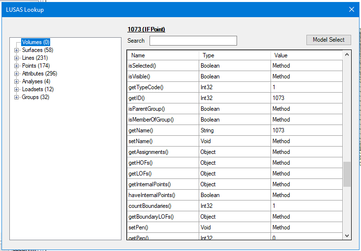

# 🔎 LUSAS-Lookup
The Lusas Lookup Module is a Windows Forms application providing a user interface to access and manage geometric and database objects within a Lusas model. It allows users to view, filter, and interact with database members such as volumes, surfaces, lines, points, attributes, analyses, loadsets, and groups through a tree-view structure, alongside a detailed properties and methods viewer.

# 📋 Features
- Tree View Navigation: Visualize all volumes, surfaces, lines, points, attributes, analyses, loadsets, and groups in a structured tree view.
- Detailed Object Viewer: Select an object in the tree view to display its properties and available methods.
- Dynamic Search and Filtering: Filter displayed items in the properties and methods table based on user input.
- Model Selection and Highlighting: Select and highlight objects in the LUSAS model directly from the UI.

# 🖥️ Usage
1. (Optional) Select a geometric object in the model.
2. Launch the dialog from the menu `Modules` > `LusasLookup`.
3. Browse the available API exposed methods of the selected object.
4. Select other model objects from the treeview.

# ⚙️ Installation
1. Install LUSAS v21.1+
  
   If you don't have a licence, you can try LUSAS for free using an [evaluation licence](https://www.lusas.com/evaluation/index.html).

   The latest LUSAS installer can be found [at the downloads section](https://www.lusas.com/user_area/download/index.html) of the official website.
2. Download the latest `LusasLookup` release for your installed kit version. You can see the version by navigating to `Help > About LUSAS Modeller...` within LUSAS (e.g. `22.0-0c2`).
3. Unzip the downloaded file at `C:\ProgramData\` (or manually compile the project in Visual Studio 2019).
